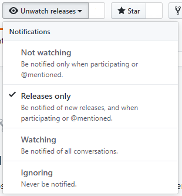
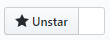

# GDPR Consent
A super flexible GDPR consent solution that, if implemented correctly, will make your site GDPR compliant.

## User Disclaimer
The current version, `1.0.0`, is the initial proof of concept and is subject to substantial change. As such we recommend that you watch the repository for releases:



## Installation
To install this project you will need to include the following code before all other scripts get loaded. If you do not do this then your site will not be able to be fully GDPR compliant as we cannot prevent other scripts from executing.
```html
<!-- GDPR Consent -->
<script>
    // TODO: Implement config:
    // https://github.com/b3none/gdprconsent#customisable-settings
    window.gdprconsent = {};
</script>
<script src="https://cdn.jsdelivr.net/gh/b3none/gdprconsent@1.0.0/build/scripts/gdprconsent.min.js"></script>

<!-- Other scripts below this point -->
```

You should also include our default stylesheet using the following snippet:
```html
<link rel="stylesheet" href="https://cdn.jsdelivr.net/gh/b3none/gdprconsent@1.0.0/build/styles/gdprconsent.min.css" />
```

#### *OR*

If the use of CDNs really isn't your style then please download the [latest release](https://github.com/b3none/gdprconsent/releases/latest) and replace the CDN urls with your own hosted version.

## Customisable settings
This project allows you to specify custom settings.
To declare these settings you need to put a script tag above the library include containing the following:
```html
<script>
  window.gdprconsent = {
    sidebarBackground: "<ANY_CSS_COLOUR_VALUE>",
    sidebarTitleTextColour: "<ANY_CSS_COLOUR_VALUE>",
    services: [
      {
        storage_key: '<ANY_KEY_YOU_WANT>',
        title: '<TITLE_IN_SIDEBAR>',
        disable: function() {
          // Callback used to disable the functionality
        },
        enable: function() {
          // Callback to enable the functionality
        },
      }
    ]
  };
</script>
```

## Contributions

We're happy to accept contributions so long as you're open to constructive criticism! Nobody is perfect!

## Versioning

We use [SemVer](http://semver.org/). For the versions available, see the [tags on this repository](https://github.com/b3none/gdprconsent/tags). 

## Authors

* **Alex Blackham** - *Developer and Maintainer* - [B3none](https://github.com/b3none)

See also the list of [contributors](https://github.com/b3none/gdprconsent/contributors) who participated in this project.

## Share the love

If you appreciate the project then please take the time to star our repository.



## License

This project is licensed under the MIT License - see the [project license](license.md) file for details
